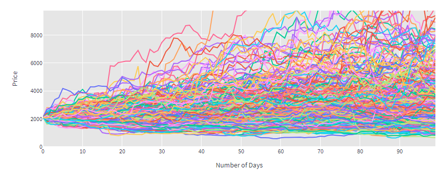
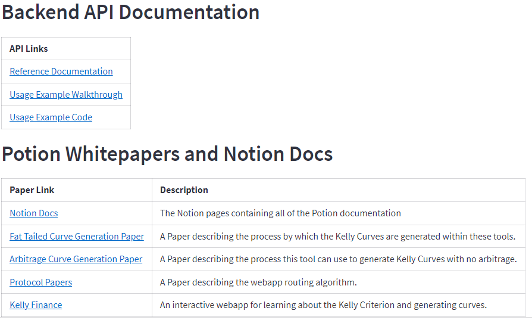
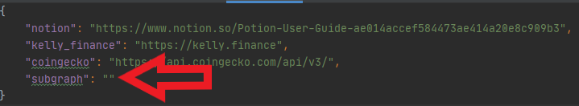

<!-- Shields -->
[](https://potion.fi/)
[](https://twitter.com/PotionLabs)
[](https://medium.com/@PotionLabs)
[](https://discord.gg/YTtG4cxg)

<div align="center">


<h1 align="center">Potion Analytics: THICC</h1>
</div>

Welcome to Potion Analytics: T.H.I.C.C (Trustworthy Helper for the Implementation and 
Calculation of Curves).

This application is a collection of tools that allow the user to create Kelly 
curves including curves for assets exhibiting fat (thicc) tailed behavior. The tools create curves for 
a Put contract (UI-only),  or any possible option payoff (with the library) and tools to backtest 
that curve in a backtesting simulator. 

The library is also capable of using any probability distribution for the input. The UI-default is 
the Student's T distribution (a fat tailed one).

If you want to read the details of the methods used, [the paper is here.](
https://www.notion.so/Bonding-Curve-Generation-for-Fat-Tailed-Models-c6293acf1f724d898877a41cf8455052)

In addition, the library functions can be configured to generate Kelly curves free of arbitrage. Please see 
the usage example for details.

If you want to read the details of this method, [the arbitrage paper is here.](
https://www.notion.so/Arbitrage-Free-Generation-of-Bonding-Curves-Using-the-Kelly-Criterion-960386e8f48c4aa6a60941738b172e8d) 

The Potion Analytics: THICC tools use Python 3.8 and higher, as well as some external python libraries.

### Streamlit UI
Primarily, the app uses [Streamlit](https://streamlit.io/) to provide a simple UI that allows the user to control 
the different tools, including: 
* a Kelly curve generation tool
* a backtester for performing simulations of the generated curves, 
* a tool to create portfolios (sometimes called pools of curves in the docs) from a single curve, 
* and a backtester tool to test simulations of portfolios of curves.

### Vaex Logging
The second major library used is called [Vaex](https://vaex.io/) and allows the backtester tools to memory map their 
log files. 

This feature allows the tools to handle very large datasets (potentially 
larger than the user's RAM, as the memory map writes the file directly to disk). The memory mapped file is stored 
in a .hdf5 format by Vaex. **This log can be converted to a CSV using a helper widget within the tool.**

Additionally, the memory mapped format allows random access to the data which is needed for much higher performance.
The benefits of Vaex to the backtesting tools include:

* The log data can be random accessed, making plotting and analysis faster  
* Can store+analyze logs larger than the user RAM
* Does not have to parse a log file sequentially 
* As a result, the number of price paths that can be simulated is much greater. 

Being able to simulate a large number of paths allows for more samples and more 
accurate statistical measurements about the backtester results.



### Python Libraries
Some other libraries which are used include numpy, scipy, pandas, scikit-learn, and plotly for creating interactive 
plots. The library kaleido is used by plotly to save svg files of results plots to disk. Finally, yfinance is sometimes 
used as data source in various unit tests. 

## Installation Steps

1. The list of required python packages is maintained in the requirements.txt file. You can install the necessary 
packages into your environment using the pip command:

    ```
    pip install -r requirements.txt
    ```

2. Next, the urls.json file must be updated.
    
    The tool has a table on the main page containing helpful links for the user. These are controlled by the 
    configuration file urls.json.
    
    
    
    The URL for any mainnet Subgraph API is unknown at the time of writing and does not exist. This URL could 
    be updated by the user before running the tool if a mainnet Subgraph exists. **If not updated, the 
    features which display existing curves for simulation will be inactive and display a message to update urls.json.**
    
    

3. Finally, to run the tools the program is started in the standard streamlit fashion: 

    ```
    streamlit run potion/streamlitapp/multipage_streamlit_frontend.py
    ```
   
   If the tools are being run from the root of the Potion payload directory, the path becomes:
   
    ```
    streamlit run potion-analytics-thicc/potion/streamlitapp/multipage_streamlit_frontend.py
    ```
   

This will start the multi page version of the app, which allows the user to open the different components like the 
curve generator or backtester in different tabs of the browser for convenience.

Running the program this way can use much of the system resources, especially if the user is running the tools 
on a resource constrained machine.

Alternatively, the user can choose to start the components individually as separate pages:
```
streamlit run potion/streamlitapp/curvegen/curve_gen_frontend.py
streamlit run potion/streamlitapp/backt/backtest_frontend.py
streamlit run potion/streamlitapp/category/cat_frontend.py
streamlit run potion/streamlitapp/multibackt/ma_frontend.py
streamlit run potion/streamlitapp/widgets/widget_frontend.py
```

#### Notes  About Running Streamlit

Since Streamlit is a newer project, it doesn't yet natively support multiple tabs in an application. As 
a result, the multipage application is actually starting separate Streamlit servers behind the scenes on different 
ports - exactly as if the user had run all of the individual commands above. 

The multipage app is optional, but allows the user to control the lifecycle of 
each tab at the click of a button rather than having to repeatedly type commands as part of the user flow.

### Project Folder Structure

```
batch_results - output folder where results (*.csv, *.svg, *.hdf5, *.zip) are placed by the tools
inputs - a directory for storing input CSVs to the tools. Formats defined in the user guides
lib - external libraries used by the project which aren't installable by pip/conda. 
      copied locally for convenience
paper - academic style paper explaining mathematical concepts for making the fat tailed kelly curve
resources - files used by the project like images or price data files
test - python module containing the unit tests and scripts
potion - main python module containing the code files
    |
    |---backtest - backend files containing the backtesting code libraries
    |---curve_gen - backend files containing the curve generation code libraries
    |---examples - code examples for using this library with another program
    |---user_guides - user guide walkthroughs of using different aspects of the tools
    |---streamlitapp - frontend files containing the UI code
        |
        |---backt - frontend files for the curve backtester tab
        |---category - frontend files for the pool creator tab
        |---curve_fetch - frontend files for subgraph curve downloader tab
        |---curvegen - frontend files for the curve generator tab
        |---log_management - frontend files for log management helper tab
        |---multibackt - frontend files for the portfolio backtester tab
        |---price_fetch - frontend files for the historical price data downloader tab
```